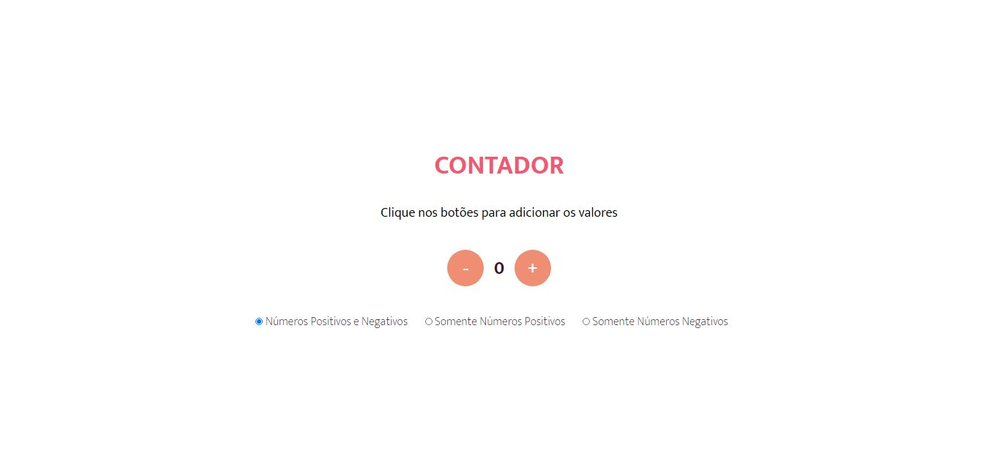

<h1 align='center'>Contator</h1>

Contador de números inteiros positvos e negativos, com as seguintes funções:

<ul>
    <li>Contar números Positivos e Negativos;</li>
    <li>Contar somente números positivos;</li>
    <li>Contar somente números negativos.</li>
</ul>

